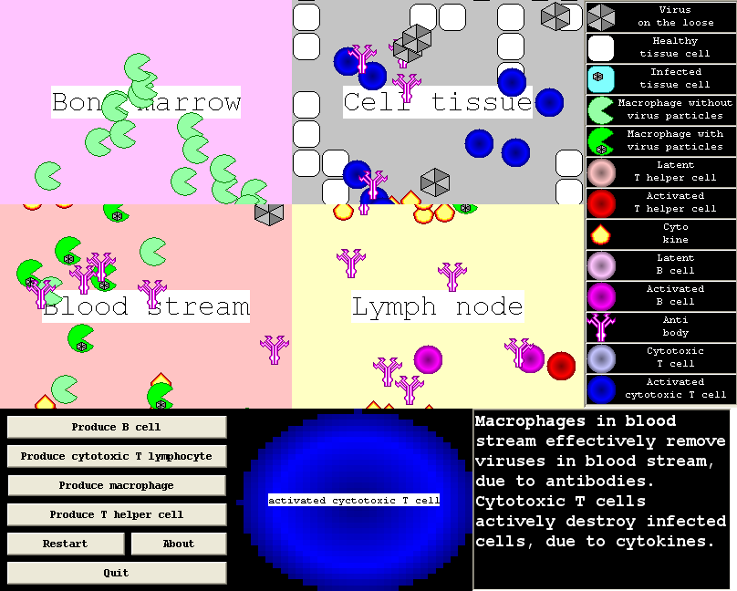

# SimImmuneResponse

Educational simulation of the human immune response using the C++ VCL library.

 * Download the Dutch lesson material: [doc](doc/TeachSimImmuneResponse.doc), [odt](doc/TeachSimImmuneResponse.odt), [pdf](doc/TeachSimImmuneResponse.pdf)
 * [Download the Windows executable](http://richelbilderbeek.nl/ToolSimImmuneResponseExe.zip)
 * Download the Dutch evaluation material: [doc](doc/TeachTestSimImmuneResponse.doc), [odt](doc/TeachTestSimImmuneResponse.odt), [pdf](doc/TeachTestSimImmuneResponse.pdf)
